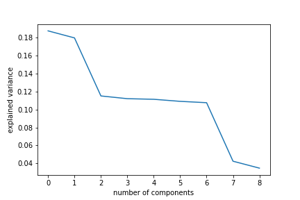

# What are the primary indicators of patient readmission?

Hospital readmission has become such an issue in recent years that Centers for Medicare and Medicaid Services (CMS) has begun to impose fines on hospitals excessive readmissions. Despite this, the percentage of hospitals fined for readmissions has increased every year. CMS reports 78% of hospitals received such fines in fiscal year 2015. [***source***] Our goal is to determine if there is a pattern among patients who are readmitted so that we can detect early on if a patient has a high readmission risk and take steps to combat it.

# The Dataset

Our data consist of 10,000 patient records with 50 features. The features can be sub-divided into the following categories: 

1. Hospital system variables
2. Patient Demographics
3. Patient Health
4. Visit details
5. Patient Survey results

## Hostpital system variables

- **CaseOrder**: Variable to preserve original order of the data file
- **Customer_id**: ID unique to each patient
- **Interaction**: ID of each patient interaction
- **UID**: transaction ID

## Patient Demographics

These features give us basic demographical imformation about the patient. They are as follows:

- **City**: City of residence as listed on the billing statement
- **State**: Patient state of residence as listed on the billing statement
- **County**: Patient county of residence as listed on the billing statement
- **Zip**: Patient zip code of residence as listed on the billing statement
- **Lat, Lng**: GPS coordinates of patient residence as listed on the billing statement
- **Population**: Population within a mile radius of patient, based on census data
- **Area**: Area type (rural, urban, suburban), based on unofficial census data
- **TimeZone**: Time zone of patient residence based on patient’s sign-up information 
- **Job**: Job of the patient (or primary insurance holder) as reported in the admissions
information
- **Children**: Number of children in the patient’s household as reported in the admissions information
- **Age**: Age of the patient as reported in admissions information
- **Education**: Highest earned degree of patient as reported in admissions information 
- **Employment**: Employment status of patient as reported in admissions information 
- **Income**: Annual income of the patient (or primary insurance holder) as reported at
time of admission
- **Marital**: Marital status of the patient (or primary insurance holder) as reported on
admission information
- **Gender**: Customer self-identification as male, female, or nonbinary

## Patient Health


- **VitD_levels**: The patient’s vitamin D levels as measured in ng/mL
- **Full_meals_eaten**: Number of full meals the patient ate while hospitalized (partial
meals count as 0, and some patients had more than three meals in a day if requested)
- **VitD_supp**: The number of times that vitamin D supplements were administered to the
patient
- **Soft_drink**: Whether the patient habitually drinks three or more sodas in a day (yes, no)
- **Complication_risk**: Level of complication risk for the patient as assessed by a primary
patient assessment (high, medium, low)
- **HighBlood**: Whether the patient has high blood pressure (yes, no)
- **Stroke**: Whether the patient has had a stroke (yes, no)
- **Overweight**: Whether the patient is considered overweight based on age, gender, and
height (yes, no)
- **Arthritis**: Whether the patient has arthritis (yes, no)
- **Diabetes**: Whether the patient has diabetes (yes, no)
- **Hyperlipidemia**z: Whether the patient has hyperlipidemia (yes, no)
- **BackPain**: Whether the patient has chronic back pain (yes, no)
Anxiety: Whether the patient has an anxiety disorder (yes, no)
- **Allergic_rhinitis**: Whether the patient has allergic rhinitis (yes, no)
- **Reflux_esophagitis**: Whether the patient has reflux esophagitis (yes, no)
- **Asthma**: Whether the patient has asthma (yes, no)


## Visit Details

- **Doc_visits**: Number of times the primary physician visited the patient during the initial
hospitalization
- **ReAdmis**: Whether the patient was readmitted within a month of release or not (yes, no). 
- **Initial_admin**: The means by which the patient was admitted into the hospital initially (emergency admission, elective admission, observation)

## Patient Survey Results

Patients are given an eight queston survey in which they are asked to rate the importance of several factors/surfaces on a scale of 1 to 8 (1 = most important, 8 = least important)

- **Item1**: Timely Admission
- **Item2**: Timely treatment
- **Item3**: Timely visits
- **Item4**: Reliability
- **Item5**: Options
- **Item6**: Hours of treatment
- **Item7**: Courteous staff
- **Item8**: Evidence of active listening from doctor

# Cleaning The Data

We'll be using python in JupyterLab for this project. Libraries included: pandas and numpy for basic data handling and math operations, scipy for calculating zscores, sklearn for Principle Component Analysis (PCA), and matplotlib for generating plots. All the code used can be found in ``data-cleaning.ipynb``.

First we import the raw csv file into a pandas DataFrame called ``medical_raw`` and run ``medical_raw.info()`` to see what we're dealing with.

## Inconsistent column names

The first thing we notice is the columns of the dataset follow the naming convention of using underscores between words except for three outliers: TotalCharge, BackPain, HighBlood, and ReAdmis, which simply capitalizes the second word we'll rename the columns as suck:

- CaseOrder: Case_order
- TotalCharge: Total_charge
- BackPain: Back_pain
- HighBlood: High_blood
- ReAdmis: Re_admis

## Missing Values

Upon initial inspection of the dataset we find that the following columns contain null values:

- Children
- Age
- Income
- soft_drink
- Overweight
- Anxiety
- Initial_days

Before we continue we shall find suitable replacements for these values using the the ``fillna()`` function of DataFrames.

### Methodology

Children, Age, Income, and Initial_days are numeric features, so we will fill the null values with the mean of the non-null values. The line of code that does this looks like:
```python
medical_raw['Children'].fillna(round(medical_raw['Children'].mean()), inplace=True)
```

Soft_drink, Overweight, and Anxiety are boolean features. They are either "Yes" and "No" or "1" and "0" (we'll fix this inconsistency later). These will be replaced with the mode of the non-null values. Like this:

```python
medical_raw['Overweight'].fillna(medical_raw['Overweight'].mode()[0], inplace=True)
```

We now have a fully non-null dataset!

### Limitations

While replacing the missing values with the mean does not disrupt the consistency of the column as a whole it can provide misleading data when a specific observation is looked at. This is still preferable to a null value.

## Outliers

### Methodology
In order to find outliers we will be calculating *zscores*, or *zvalues* for the numeric fields. Once we have standardized z-scores we'll use the standardized values to easily remove the outliers.

The numeric fields we'll be getting zscores for are:

- Population
- Children
- Age
- Income
- Doc_visits
- Full_meals_eaten
- Initial_days
- Total_charge
- Additional Charges

We drop all entries that have outliers (below -3 and above 3). This brings our total number of entries down to 9,037 from 10,000. Just under 10% data loss.

### Limitations

Losing almost 10% of the dataset is not ideal. We may decide that a certain amount of missing values is workable or that we only remove an observation if it is missing multiple values.

# Principle Component Analysis

 


